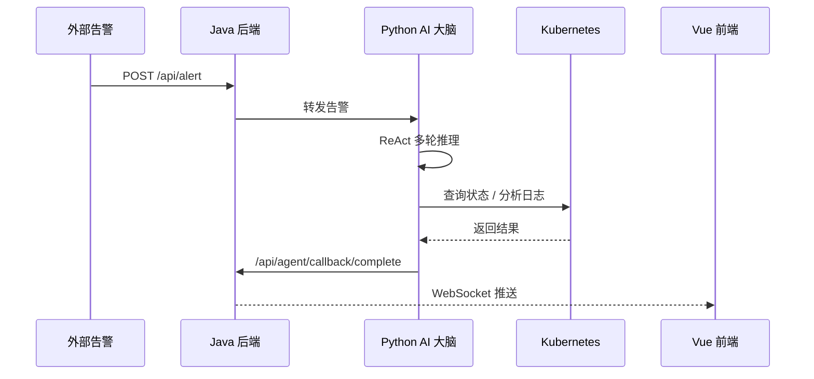

# 架构设计

## 整体架构

AIOps 平台由三层组成：

| 层级 | 组件 | 职责 |
|------|------|------|
| 前端层 | Vue 3 + Element Plus | 可视化运维大盘、告警列表、工具调用 |
| 后端层 | Java Spring Boot 3.4 | 告警接收、工具调用、WebSocket 推送 |
| AI 层 | Python FastAPI + LangChain | ReAct 推理、根因定位、修复建议 |

## 调用链路

## 模块说明

### AI 大脑（aiops-agent）

- 基于 FastAPI 暴露 HTTP 接口
- 使用 LangChain ReAct Agent 做多轮推理
- 支持工具：知识库检索、服务状态查询、日志分析、重启/扩容/回滚、人工审批
- 使用 Chroma 做向量检索

### Java 后端（ops_agent）

- 基于 Spring Boot 3.4
- 接收告警、管理任务、调用工具
- 通过 WebSocket 推送执行步骤
- 使用 `X-Internal-Token` 与 AI 大脑做内部鉴权

### 前端（ops-agent-front）

- Vue 3 + Vite + Element Plus
- 实时仪表盘、告警列表、任务管理、工具调用
- 通过 WebSocket 订阅 `taskId`，实时展示步骤